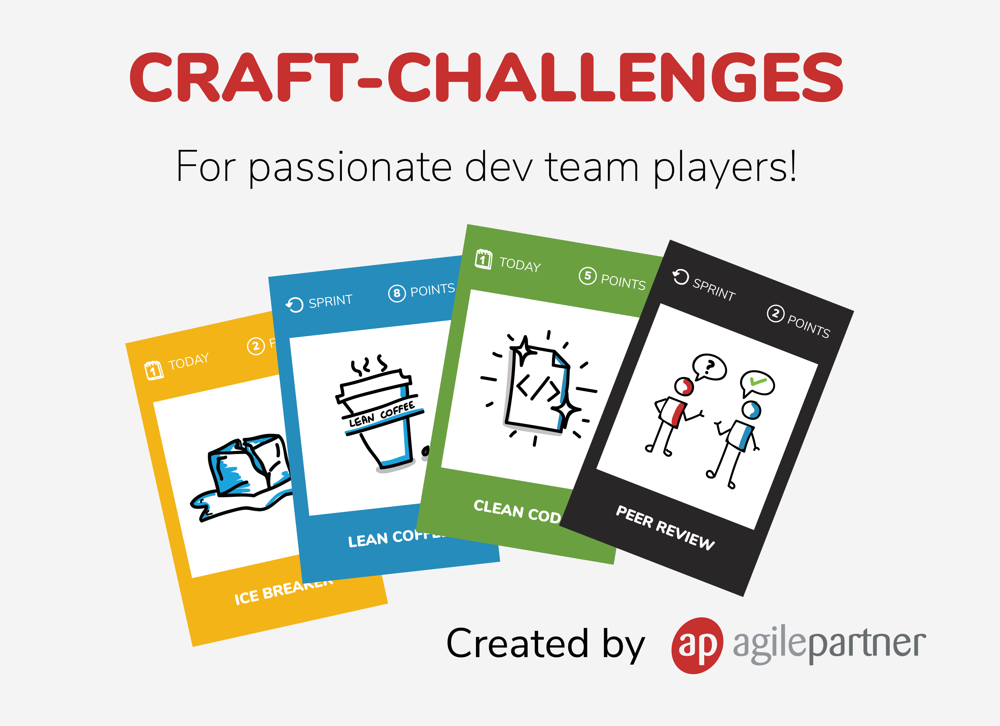
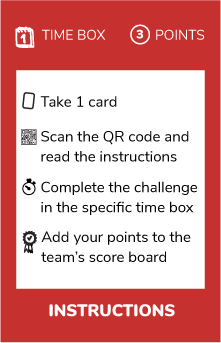
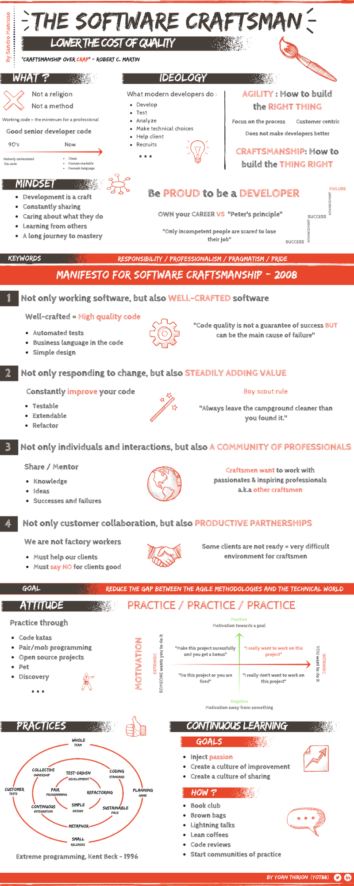

# Craft challenges

Welcome to this software craftsmanship challenge !!!

This repository contains cards and instructions in order to organize craft challenges in your companies.  
Those challenges are organized in 4 categories :

## [Challenges](challenges/Readme.md)
## [Dev](dev/Readme.md)  
## [Practices](practices/Readme.md)
## [Culture](culture/Readme.md)  

If you have any questions or if you need further informations don't hesitate to <a href="mailto:ythirion@agilepartner.net?Subject=Craft%20challenges">contact us</a>

### How to play ?
You can use the cards as described below :  
* Each team member takes 1 card
* He/she has to connect to the related page on github through the **QR code or the url**
* Take some time to deep dive into the topic
* Do the challenge in the given time box (at the top left of the card)
* Print a score board and hang it on the wall in your office
* Add the points you earned by doing this card (on the top right of the card)

#### OR use it as you want :
* Topics for retrospectives
* Topics for lean coffees
* Deep dive in brown bag lunches
* ...

#### Instructions card :

> ### You can print all the cards from this [folder](/cards)

## Software craftsman
> ### If you want to truly understand what is a **software craftsman** we recommend you to read *["The software craftsman"](https://www.amazon.com/Software-Craftsman-Professionalism-Pragmatism-Robert/dp/0134052501)* by Sandro Mancuso.

Here is our abstract of the book.

