# Challenges
[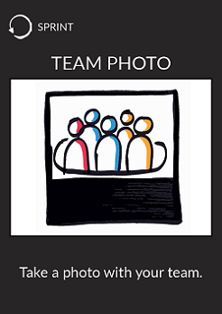](team-photo.md)
[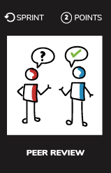](pair-review.md)
[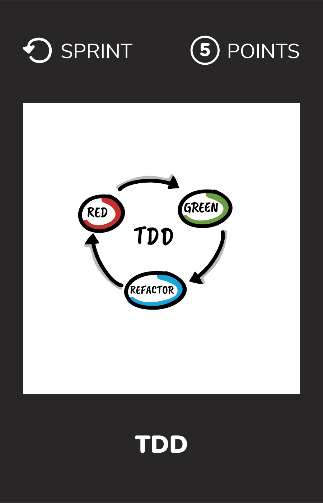](tdd.md)
[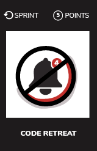](code-retreat.md)
[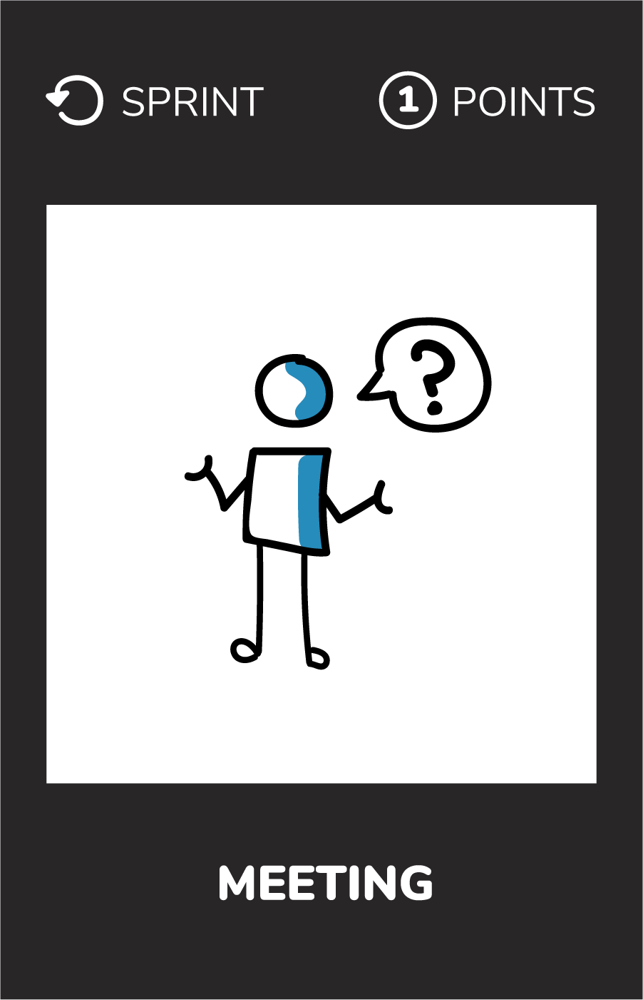](meeting-question.md)
[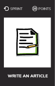](write-article.md)
[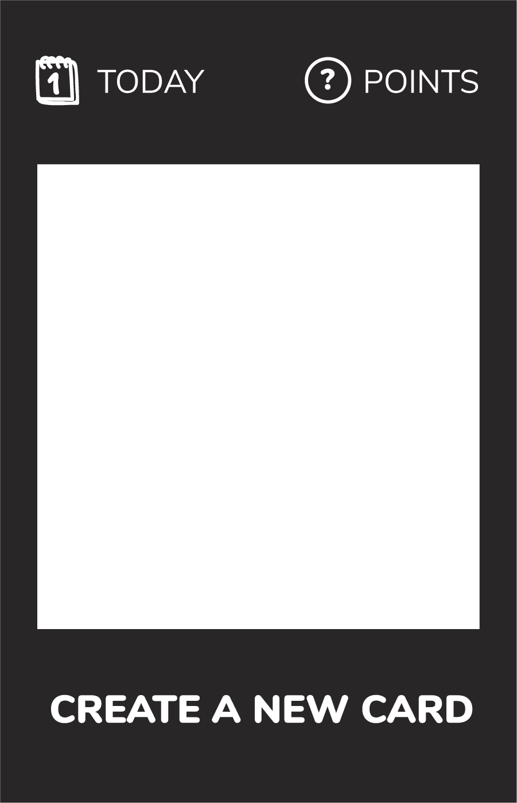](create-a-new-card.md)
[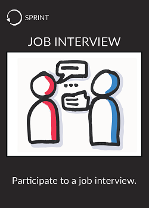](job-interview.md)
[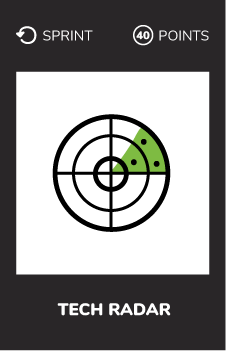](tech-radar.md)
[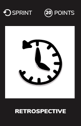](retrospective.md)
[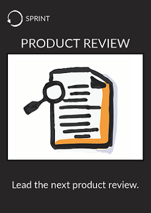](product-review.md)
[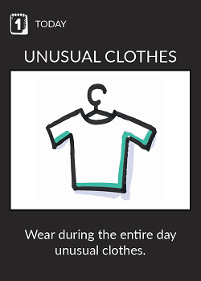](unusual-clothes.md)

# Print the cards
* [Recto](../cards/challenge-recto.pdf)  
* [Verso](../cards/challenge-verso.pdf)
