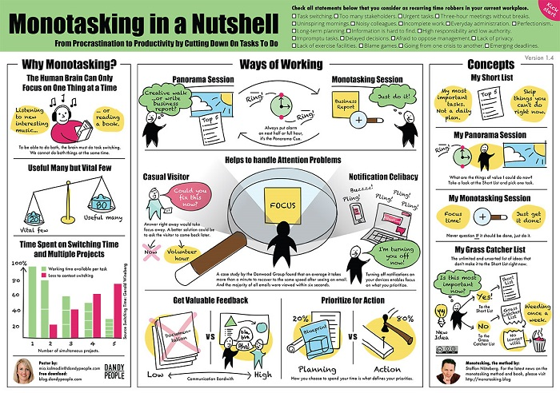

# Code retreat
  

## What ?
A CodeRetreat is an intensive practice event, focusing on the fundamentals of software development and design. 
It gives the opportunity to practice TDD, Clean Code, Refactoring, ... 

## Why ?
As we want to be better developers, we need to learn continuously.
Because we are not humanoids; our **cognitive resources are limited** and we are not able to multitask, so we need to dedicate time for it. 
Doing a code retreat is a very good way to stay focused and improve our performance.

## How ?
- Turn off your notifications for the next 4 hours :
    - No emails
    - No smartphone
- Choose a topic you want to discover or improve
- Deep dive into it

> ### Turning off notifications enables focus on what you prioritize.

  

## Resources (to stay focus)
* [Pomodoro technique](https://lifehacker.com/productivity-101-a-primer-to-the-pomodoro-technique-1598992730)
* [The pomodoro technique in 40 seconds](https://www.focusboosterapp.com/the-pomodoro-technique)
## Share
[ Share this challenge](https://twitter.com/home?status=I%20have%20just%20completed%20the%20Code%20retreat%20%23craft_challenges%20from%20%40agilepartner%20http://tiny.cc/p7v5vy)
