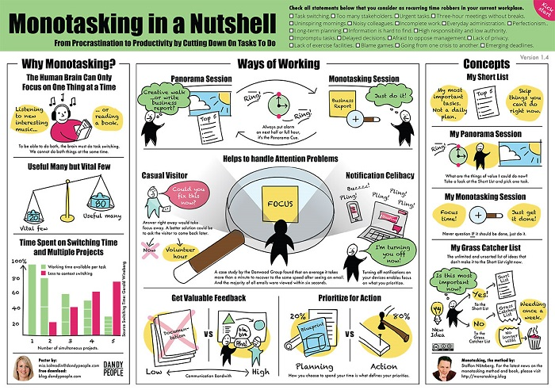

# Code retreat
  

Turn off your notifications for the next 4 hours :
* No emails
* No smartphone 

> ### Turning off notifications enables focus on what you prioritize.

Because we are not humanoids; our **cognitive resources are limited** so we are not able to multitask.  
Do a code retreat is a very good way to stay focused and improve your performance.

  

## Resources
* [Pomodoro technique](https://lifehacker.com/productivity-101-a-primer-to-the-pomodoro-technique-1598992730)
* [The pomodoro technique in 40 seconds](https://www.focusboosterapp.com/the-pomodoro-technique)

