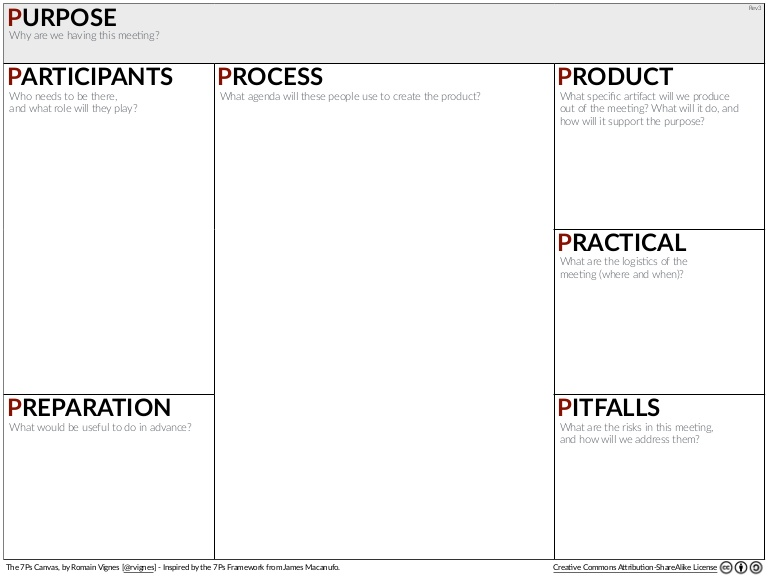

# Ask a question during your next meeting (or conference)
  

* Go to a meeting
* Find a moment to ask a question
* Challenge the answer
* Deep dive into it

> ### As a developer you are not only someone who can translate business language to code. **You are much more than that**.
That is why you need to challenge things when it is needed.  
So never be afraid to ask questions.  

> ### It is part of our sofwtare craftsman activity to challenge things **even if it is not what our clients want to hear.**

  