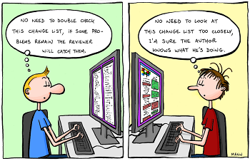
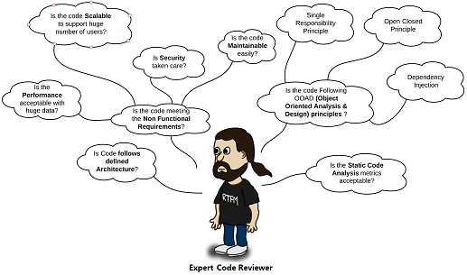

# Do a pair review in an other team

Practicing `code review` aims to improve code quality, share knowledge and find bugs.  
Practicing `code review` in another team promotes collaboration, communication.

## What is a pair review ?
Review other team members code  
  
because this kind of things can happen...

What we recommend is to add the pair review step into your process of delivery (inside your **Definition of Done** for example)

