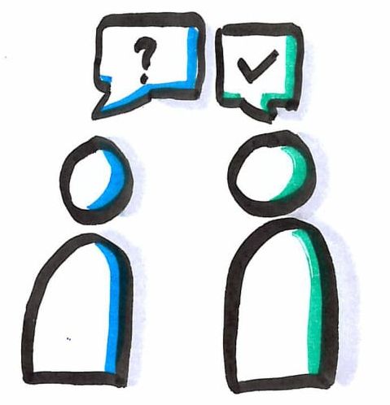

# Do a pair review in an other team

Practicing `code review` aims to improve code quality, share knowledge and find bugs.
Practicing `code review` in another team promotes collaboration, communication.
