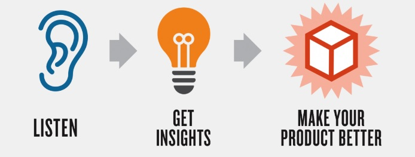

# Product review
  

## What ?
Product review or sprint review (in a framework like scrum) is a dedicated meeting to gather feedback on the product that a self-organized team is working on.   

## Why ?
To produce the fitted product we need to `continuously acquire feedback and adapt our plans accordingly`.  
Those feedback can dramatically influence what will be worked on in subsequent weeks.  

## How ?
* Gather your Product Owner/stakeholders/everyone interested in the product
* Demonstrate the new functionalities that have been done
* Gather people's feedback

  

## Resources
* [Sprint review : Much more than just a Demo](https://www.scrum.org/resources/blog/sprint-review-much-more-just-demo)
* [An agenda for the sprint review](https://www.mountaingoatsoftware.com/blog/an-agenda-for-the-sprint-review)
* [How to run a successful sprint review](https://backlog.com/blog/successful-sprint-review-meeting/)
