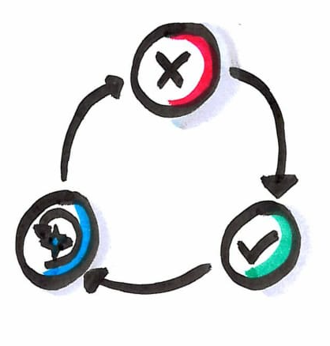
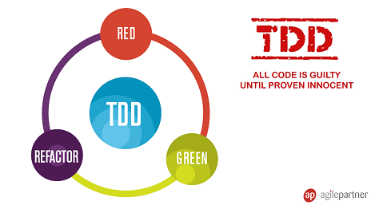

# Write a functionality using Test Driven Development
  

* Start to work on a new functionality
* Think about your tests first
* Write your tests and your implementation through T.D.D

## What is Test Driven Development ?
`Test-driven development (TDD) is a software development process that relies on the repetition of a very short development cycle: Requirements are turned into very specific test cases, then the software is improved to pass the new tests, only.`

### TDD steps  
* Add a test  
* Run all tests and see if the new one fails  
* Write some code  
* Run tests  
* Refactor code  
* Repeat

  
