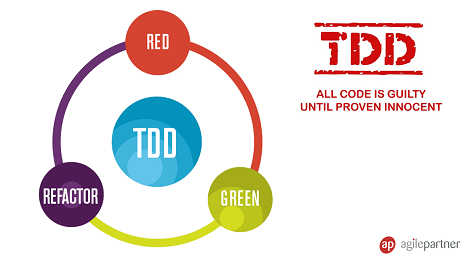

# Write a functionality using Test Driven Development
  

* Start to work on a new functionality
* Think about your tests first
* Write your tests and your implementation through T.D.D
* Share with your teammates about your experimentation

## What is Test Driven Development ?
> ### Test-driven development (TDD) is a software development process that relies on the repetition of a very short development cycle: Requirements are turned into very specific test cases, then the software is improved to pass the new tests, only.

### TDD steps  
* Add a test  
* Run all tests and see if the new one fails  
* Write some code  
* Run tests  
* Refactor code  
* Repeat

  

## Resources
* [TDD definition](https://www.agilealliance.org/glossary/tdd/)
* [What is TDD](http://agiledata.org/essays/tdd.html)
* [TDD example](https://technologyconversations.com/2013/12/20/test-driven-development-tdd-example-walkthrough/)

  