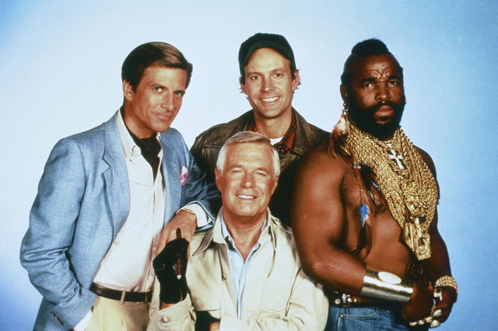

# Team photo
  

## What ?
Take a photo with your team mates.

## Why ?
Nothing is more rewarding than sharing the adventure of building something that truly matters with engaged teammates.
Teamwork is essential to deliver great software.  

> ### Great agile teams embody "we" rather than “I".
This kind of practice will help you to create empathy between teammates. 

## How ?
* Gather your team
* Take a photo with your team
* Publish it or stick it in your company

> **Warning** : Do not forget to respect your GDPR company's policy.

## Resources
* [Great team culture](https://tallyfy.com/build-great-team-culture/)
* [How to build great team culture - 60 pointers](https://blog.jostle.me/blog/how-to-build-a-great-team-and-culture-60-pointers/)
* [50 ideas for building team culture](https://code.likeagirl.io/50-ideas-for-building-team-culture-more-effectively-839469bf19a5)

## Share
[ Share this challenge](https://twitter.com/home?status=I%20have%20just%20completed%20the%20Team%20photo%20%23craft_challenges%20from%20%40agilepartner%20http://tiny.cc/p7v5vy)