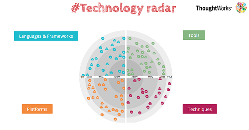
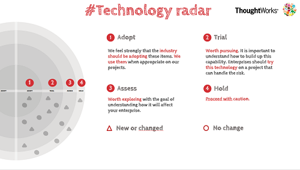

# Technology radar

* Organize a workshop about structuring your technology watch
* Let people list :
  * Languages & frameworks
  * Tools
  * Platforms
  * Techniques  
  
* Sort them :
  * Adopt
  * Trial
  * Assess
  * Hold  
  

At the end of this workshop you can build your online tech radar by going on the thoughtworks website [here](https://info.thoughtworks.com/visualize-your-tech-strategy-guide.html).  

## What is it ?
The tech radar has been created by Thoughtworks Technology Advisory Board, a diverse group of senior technology leaders from all over the ThoughtWorks’ world. 
They meet regularly to discuss the technology strategy for ThoughtWorks and the technology trends that impact our industry. 
Technology and business move fast, so they release a new edition of the Radar every six months.

Find details [here](https://info.thoughtworks.com/technology-radar-subscription.html).  

## Benefits
* Organize your technology watch
* Align people on technologies

You can also use this tool to manage your technical debts.

## Resources
* [Thoughtworks technology radar](https://www.thoughtworks.com/radar)
* [Atlassian tech radar plugin](https://marketplace.atlassian.com/plugins/de.iteconomics.confluence.techradar/server/overview)
* [Build your own technology radar](http://techradar.io/)