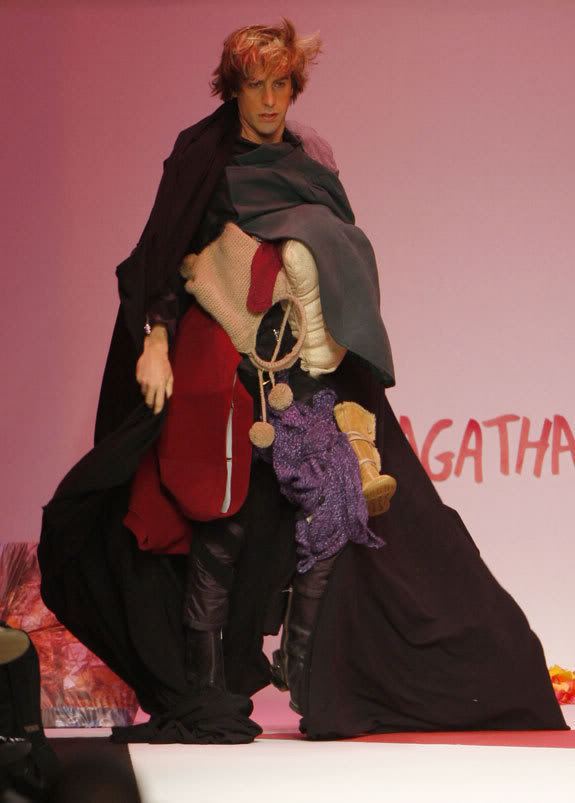

# Unusual clothes
  

## What ?
Wearing unusual clothes will `bring fun at your office` especially when nobody is aware about it. 

## Why ?
The benefits of working as we have fun are clearly spotted as follows:
* Positive motivation
* More flowing communication
* Effective Leadership
* Leadership development  

That's why i'ts really important to have fun in your daily work.

## How ?
During 1 day:
* Wear unusual / weird clothes

## Share
[ Share this challenge](https://twitter.com/home?status=I%20have%20just%20completed%20the%20Unusual%20clothes%20%23craft_challenges%20from%20%40agilepartner%20http://tiny.cc/bd40wy)