# Culture
[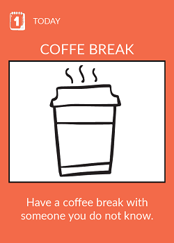](coffee-break.md)
[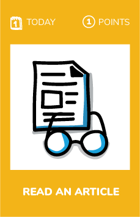](read-1-article.md)
[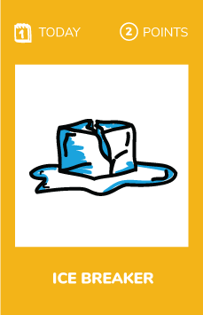](ice-breaker.md)
[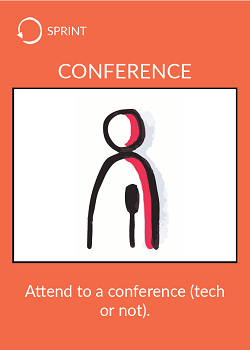](conference.md)

[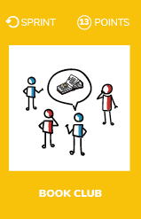](technical-book.md)
[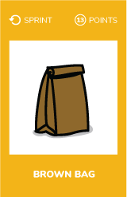](brown-bag.md)
[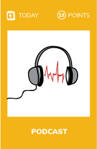](craft-podcast.md)
[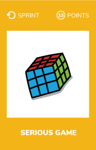](serious-game.md)
[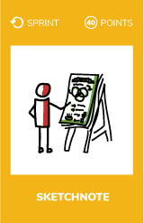](sketchnote-meeting.md)

[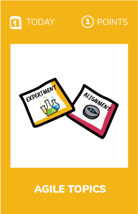](agile-topics.md)
[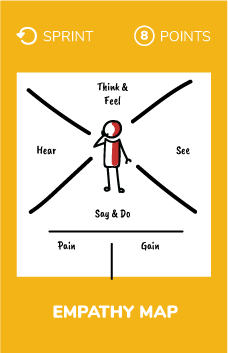](personal-map.md)

# Print the cards
* [Recto](../cards/culture-recto.pdf)  
* [Verso](../cards/culture-verso.pdf)
