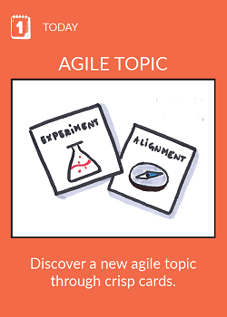
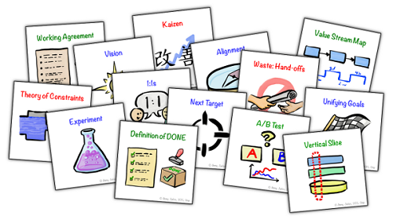

# Agile topics

## What ?
"Agile topics" is a deck of cards created by [*Jimmy Janlén*](https://www.linkedin.com/in/jimmyjanlen/) from Crisp.  
Each card represents an agile practice, a conversation topic or an abstract theory.

## Why ?
> Because we don't know what we don't know.  

This deck can really help us to discover new concepts and practices around agility.

## How ?
* Go to this [website](http://blog.crisp.se/2015/10/08/jimmyjanlen/agile-topics-card-deck)
* Print the cards
* Take one card and dive deep into the subject
* Share your discovery with your team mates
* Take actions

Those cards can be used as :
* Topics for : 
    * Lean coffees
    * Organizational reviews
    * Agile brown bags
* 1:1 conversation starters

## Resources
* [Agile topic cards](http://blog.crisp.se/2015/10/08/jimmyjanlen/agile-topics-card-deck)
