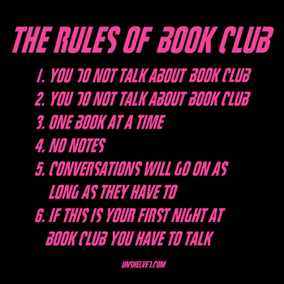

# Create a book club

The goal of a book club is to discuss/share about a given book so :
* Create a book club
* Organize a monthly session
* Share about the book of the month

## How to ?
* Choose a book with your colleagues
    * Each attendee can introduce the book he wants to read
    * Vote for the more interesting one

## Resources
* [How to Start a Book Club Checklist](https://www.realsimple.com/work-life/start-book-club-checklist)
* [How to Start a Book Club](http://www.oprah.com/oprahsbookclub/how-to-start-your-own-book-club)
* [Create a book club](http://www.penguin.com/read/book-clubs/create/)