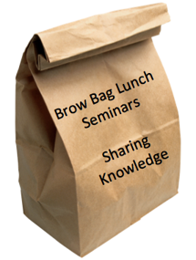

# Organize a Brown bag lunch

A brown bag lunch is an open session that is organized during the lunch time.
It can have various formats :
* Conference
* Open discussion about any topics
* Video watching
* Twitter reading

## Why is it called brown bag lunch ?
Each attendee comes with his/her lunch (in a brown bag) it's that simple ;-)

## Our tips
* Everyone can give short presentations
* No formalism
* Create the buzz : Communicate about the sessions

## How to
* [Organize a brown bag session](https://proessler.wordpress.com/2014/09/07/how-to-set-off-a-brown-bag-session-in-your-company-in-60-minutes/)
* [Share/Learn/Socialize](https://dius.com.au/2016/05/27/dius-brown-bags/)
