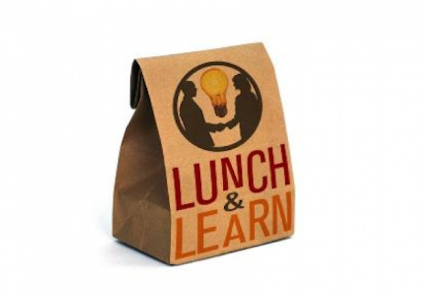

# Brown bag

## What ?
A brown bag lunch is an open session that is organized during the lunch time.  
It can have various formats :
* Conference
* Open discussion about any topics
* Watching and debriefing of a video
* Review of twitter subscriptions / news reading
* ...

## Why ?
This kind of event has at least 3 goals:
* Enhance employees skills and knowledge by sharing ideas, new projects or insights
* Build team work
* Spread a positive and **ongoing learning culture**

## How ?
* Find a topic you want to share
    * Your current project
    * A new framework
    * A discovery
    * ...
* Lock a date (during lunch time)
* Invite a large audience
* Present your topic

### Our tips
* Don’t limit the audience
* Don’t limit yourself to content that is directly aligned with your current work
* Provide lunch -> find sponsorship
* Make sure everyone takes something away
* Always leave plenty of time for discussion / sharing

## Resources
* [Organize a brown bag session](https://proessler.wordpress.com/2014/09/07/how-to-set-off-a-brown-bag-session-in-your-company-in-60-minutes/)
* [Share/Learn/Socialize](https://dius.com.au/2016/05/27/dius-brown-bags/)
