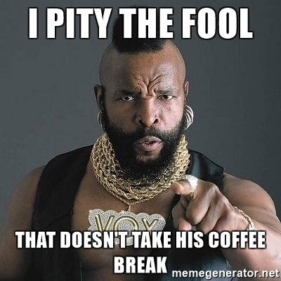

# Coffee break
  

## What ?
Simply have a coffre break with someone you don't know or don't know very well.

## Why ?
>"*People are the most important parts of an organization*" - Jurgen Appello.

By connecting to other people you are not interacting with in your daily work, you will :
* Make new friends
* Expand your network 

## How ?
* Identify someone you do not know or don't know very well
* Offer him to take a coffee together
* Connect with him

  
