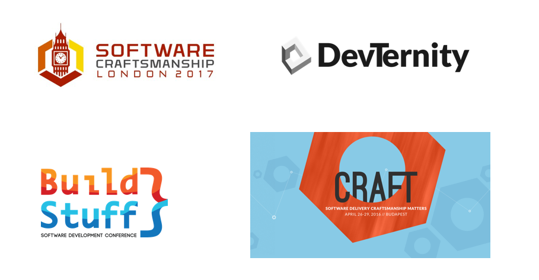

# Conference
  

* During the current iteration, find an conference to attend to.
* The conference can be about anything.
* You can find local community with platforms such as [meetup.com](https://www.meetup.com).

## Bonus 
Propose to your team to give them a feedback in a 10-mins timebox.

## Good Conferences
- [Devternity](https://devternity.com/)
- [BuildStuff](http://buildstuff.lt/)
- [Craft-conf](https://craft-conf.com/)
- [Devoxx](https://devoxx.com/)
- [Voxxeddays](https://voxxeddays.com/)

 
