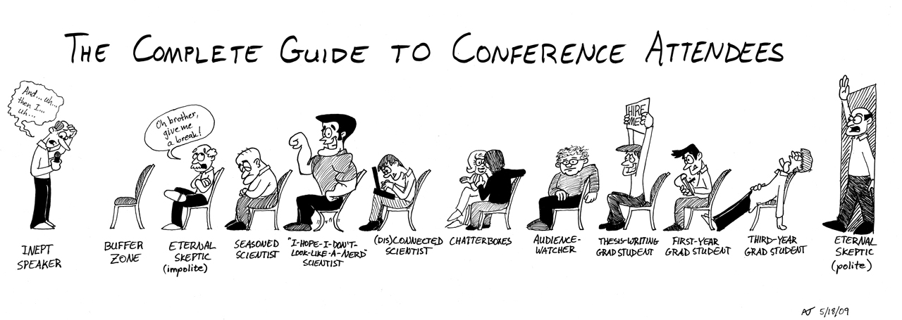

# Conference
  

## What ?
A conference is generally understood as a meeting of several people to discuss a particular topic. 

## Why ?
Now there are so many great ways to learn and sharpen your skills these days: 
* You can read blogs
* Listen to podcasts
* Watch how-to videos on YouTube
* Attend webinars

> But live events—conferences, workshops, lunch & learns–provide unique learning and career building opportunities that you just can’t find anywhere else. 
 
There are plenty of reasons why attend conference is really important to expand your learning :
* Educational opportunities :
    * No matter how experienced you are, everyone can learn
* Networking with peers
* Position yourself as an expert
* Have fun

## How ?
* During the current iteration, find an conference you want to attend to
* The conference can be about anything
* Book a ticket for the found event

You can find local community with platforms such as [meetup.com](https://www.meetup.com).

  

## Resources
* [12 Reasons You Should Attend Conferences](https://www.takeflyte.com/reasons-to-attend-conferences)

### Great conferences
- [Devternity](https://devternity.com/)
- [NCrafts](https://ncrafts.io/)
- [BuildStuff](http://buildstuff.lt/)
- [Craft-conf](https://craft-conf.com/)
- [Devoxx](https://devoxx.com/)
- [Voxxeddays](https://voxxeddays.com/)

## Share
[ Share this challenge](https://twitter.com/home?status=I%20have%20just%20completed%20the%20Conference%20%23craft_challenges%20from%20%40agilepartner%20http://tiny.cc/p7v5vy)