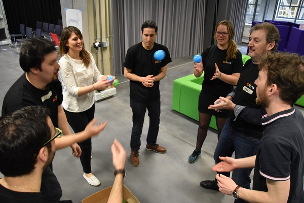

# Ice breaker
  

* Take a moment to explore ice-breaker repositories
* Select a warm-up exercise the will brighten your team
* After the next daily meeting, ask to find a suitable morning
* Warm-up your team with an ice-breaker!

## Resources
* [icebreakers.ws](https://www.icebreakers.ws/)
* [#play14](http://play14.org/games/)
* [40 ice breakers for small groups](https://insight.typepad.co.uk/40_icebreakers_for_small_groups.pdf)
* [7 Icebreakers for Meetings](https://funattic.com/icebreakers-for-meetings.htm)

