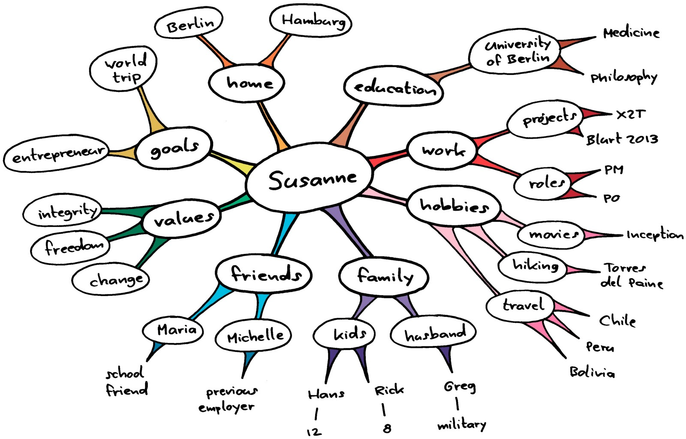

# Personal map

## What ?
When you communicate with many people, it can be difficult to remember every little detail. A way to deal with this amount information is to build mind maps about personal facts to remember details quickly.  
A mind-map is a visual and structured representation of information. 
In Management 3.0, this kind of mind map is called a Personal Map.

## Why ?
People should get closer to the work of others in order to better understand what is going on.  
They can do this by :
* Moving their feet
* Moving their desk
* Moving their microphone

Decreasing the distance of yourself to others helps to increase communication and creativity. 

> A great exercise for a better understanding of people is to capture what you know about them in personal maps.

## How ?
> *By creating a personal map of a colleague, you make an effort to better understand that person.*

In your team, explain the exercise as following:
* Explain the purpose and how to create a personal map
* Use a template - like define below
* Allow a time-slot - 10' for example
* Instruct to write clearly and briefly
* Put all the personal maps on the wall
* Let each person take a personal map (but not his own!)
* Introduce that person
* Continue till each personal map has been presented

Keep in mind that these personal maps are **not a one-time exercise**, these evolve as life continues! Iterate personals maps on regular times.

## Resources
* [Management 3.0 Practice : Personal Maps Build Closeness in Modern Teams](https://www.youtube.com/watch?v=T9d8w-OG-Fk)
* [Personal maps : team workshop](https://www.linkedin.com/pulse/personal-maps-management-30-frederik-vannieuwenhuyse/)
* [Decreasing mental distance with Personal Maps](https://medium.com/@tadeumarinho/decreasing-mental-distance-with-personal-maps-11cc69d15af3)

## Share
[ Share this challenge](https://twitter.com/home?status=I%20have%20just%20completed%20the%20Personal%20map%20%23craft_challenges%20from%20%40agilepartner%20http://tiny.cc/p7v5vy)