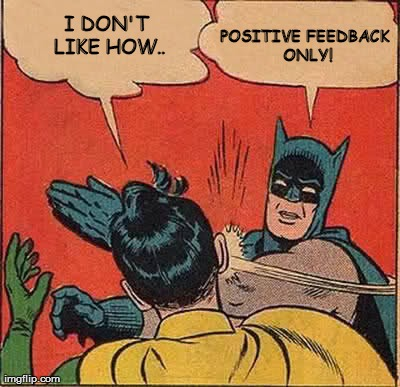

# Give positive feedback to a team mate

Feedback is a powerful tool to support behavioral change or reinforce positive behavior in the workplace.

Positive feedback, much like the **constructive type, must be specific and behavioral in nature to be effective.**  
The positive comment feels good, but it does not leave you better able to repeat the positive performance in the future, just as a negative comment: *"You sure messed up that presentation"* would not tell you what you did wrong.  
Both giver and receiver benefit by getting specific with feedback.

> Never hesitate to provide positive feedbacks to your colleagues.

## Rules for delivering positive feedback
* Always **deliver feedback as close in time to the occurrence** of the positive behavior as possible.
* **Be specific** : The more specific you are as the giver, the better the opportunity for the receiver to understand what behaviors to repeat in the future.
* Try to **link** the positive behavior to the **business results**. 
* Positive feedback can be **delivered in public**

