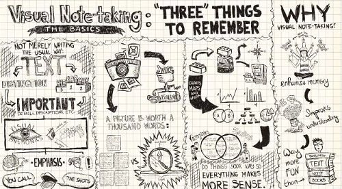

# Sketchnote

## What ?
Visual notetaking is a creative way to take notes using pictures, typography, lines, shapes, and doodles, with marker-and-paper or stylus-and-tablet.

## Why ?
The value of sketchnoting is supported by several theories, such as the dual coding theory and the picture superiority effect.  
The dual coding theory, states that both verbal and nonverbal processing is essential to learning.  
The theory suggests that our minds have two separate stores of information (verbal representations and mental images) and learners require both to adequately retain and retrieve knowledge. Similarly, the picture superiority effect states that the **combination of both visuals and texts is more effective than just text**.  

The manin benefits are :
* Use visual cues to boost memory retention
* Keep our brain active and engaged with variety and stimulation
* Develop ideas more comprehensively by creating connections between points
* Use it to create presentations that rock

## How ?
Instead of taking classic notes (only textual) during a meeting : sketchnote.

Sketchnoting combines traditional handwritten notes with drawings, symbols, and other creative elements. The result is an engaging map of ideas with clear visual cues.

> Sketchnoting is all about **visual communication**.

## Resources
* [Quick start guide](https://www.jetpens.com/blog/sketchnotes-a-guide-to-visual-note-taking/pt/892)
* [The Basics of Visual Note-taking](http://www.core77.com/posts/19678/sketchnotes-101-the-basics-of-visual-note-taking-19678)
* [Taking Visual Notes with Sketchnotes (video)](https://www.youtube.com/watch?v=V3FtB9F7rv0)

## Share
[ Share this challenge](https://twitter.com/home?status=I%20have%20just%20completed%20the%20Sketchnote%20%23craft_challenges%20from%20%40agilepartner%20http://tiny.cc/p7v5vy)
