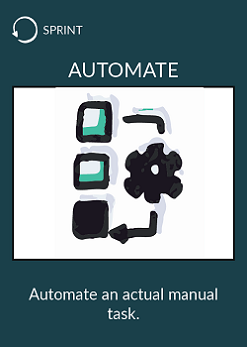

# Automate an actual manual task
 
* Identify a repeated manual task inside your team
    * Think about your current process
    * Materialize it with a kanban board
    * Find where is the waste
* Automate it
* **Eliminate the waste**

  