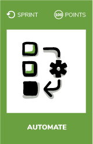
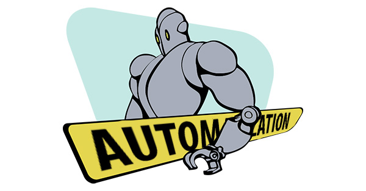

# Automate

## What ?
Basic idea lean is to eliminate anything and everything that does not add value from the perspective of your customer.  
Another way to look at lean manufacturing is as a collection of tips, tools, and techniques (i.e. best practices) that have been proven effective for **driving waste out** of the manufacturing process.  
We can apply those principles to our daily tasks.  
In teams, we can eliminate waste by automating manual stuff that we repeat a lot. 

## Why ?
To improve team's efficiency.

## How ?
* Identify a repeated manual task inside your team.  
    One idea to identify wastes could be as follow :
    * Think about your current process
    * Materialize it with a kanban board
    * Find where is the waste
* Automate it
* **Eliminate the waste**

  
## Resources
* [7 wastes - Lean Software Development](https://dzone.com/articles/seven-wastes-software)
* [7 principles of Lean Software Development](https://agilevelocity.com/lean/7-principles-of-lean-software-development/)

## Share
[ Share this challenge](https://twitter.com/home?status=I%20have%20just%20completed%20the%20Automate%20%23craft_challenges%20from%20%40agilepartner%20http://tiny.cc/p7v5vy)

