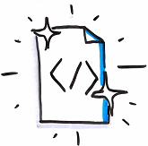

# Clean some "dead" or "crappy" code
  
* Identify a "code smell"
    * A "dead code"
    * A complex piece of code / "crappy" code
* Refactor it or delete it if it is unnecessary

## Resources :  
* [How to write clean code ???](https://www.butterfly.com.au/blog/website-development/clean-high-quality-code-a-guide-on-how-to-become-a-better-programmer)
* "Clean code" - *Robert C. Martin* ([here](https://www.amazon.fr/Clean-Code-Handbook-Software-Craftsmanship/dp/0132350882/ref=sr_1_1?ie=UTF8&qid=1509989642&sr=8-1&keywords=clean+code) on amazon)