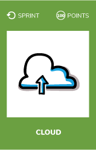
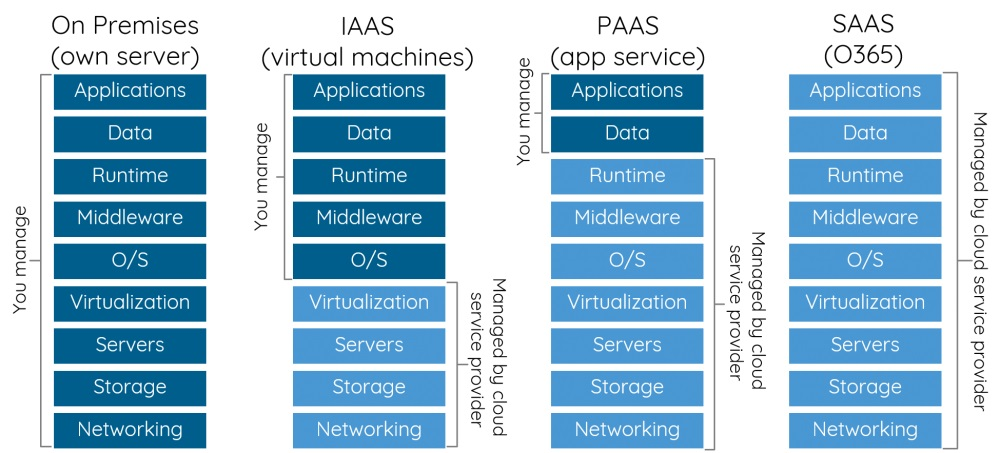
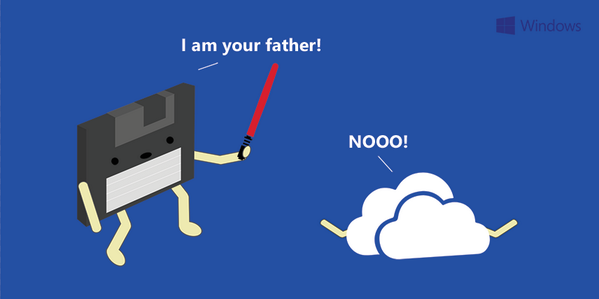

# Cloud

## What ?
Cloud computing is the delivery of computing services/servers, storage, databases, networking, software, analytics and more—over the Internet (“the cloud”).  
Companies offering these computing services are called cloud providers and typically charge for cloud computing services based on usage, similar to how you are billed for water or electricity at home.

### Different types of cloud services
Most cloud computing services fall into three broad categories. These are sometimes called the cloud computing stack, because they build on top of one another. 

#### Infrastructure-as-a-service (IaaS)
The most **basic** category of cloud computing services. 
With IaaS, you rent :
* IT infrastructure—servers and virtual machines (VMs)
* Storage
* Networks
* Operating systems—from a cloud provider

#### Platform as a service (PaaS)
Platform-as-a-service (PaaS) refers to cloud computing services that supply an **on-demand environment for developing, testing, delivering and managing software applications**.   
PaaS is designed to make it easier for developers to quickly create web or mobile apps, without worrying about setting up or managing the underlying infrastructure of servers, storage, network and databases needed for development.

#### Software as a service (SaaS)
Software-as-a-service (SaaS) is a method for **delivering software applications over the Internet**, on demand and typically on a subscription basis.  
With SaaS, cloud providers host and manage the software application and underlying infrastructure and handle any maintenance, like software upgrades and security patching. Users connect to the application over the Internet, usually with a web browser on their phone, tablet or PC.

## Why ?
Cloud computing has a major impact in our industry. It has been a big shift from the traditional way businesses think about IT resources. 
It has a lot of benefits :
* Cost reduction : eliminates the capital expense of buying hardware and software
* Speed : provision resources in a few minutes
* Global scale : ability to scale elastically
* Improved productivity : IT teams can spend time on achieving more important business goals than provisioning servers
* Performance : services run on a worldwide network of secure datacenters, which are regularly upgraded to the latest generation of fast and efficient computing hardware.
* Reliability : Cloud computing makes data backup, disaster recovery and business continuity easier and less expensive

## How ?
* Choose a cloud provider, here are the 3 most used at the moment :
    * Amazon Web Services
    * Azure
    * Google Cloud
* Deploy an application in the cloud
    * A simple web app for example

## Resources
* [Create a web app and deploy it in Azure](https://azure.microsoft.com/en-us/get-started/web-app/)
* [Deploying Applications to AWS Elastic Beanstalk Environments](https://docs.aws.amazon.com/elasticbeanstalk/latest/dg/using-features.deploy-existing-version.html)
* [Google Cloud Getting started](https://cloud.google.com/getting-started/)

## Main cloud providers documentations
* [Amazon web services](https://aws.amazon.com/fr/documentation/)
* [Azure](https://docs.microsoft.com/en-us/azure/index)
* [Google cloud](https://cloud.google.com/docs/)

