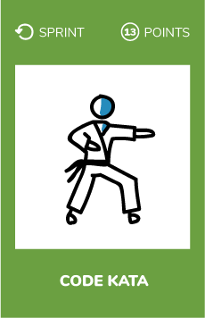
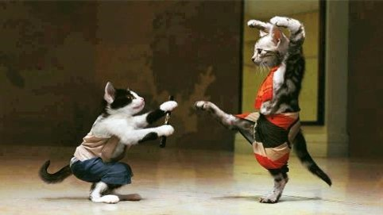

# Code kata
  

## What ?
A kata, or code kata, is defined as an exercise in programming which helps hone your skills through practice and repetition.

### Many kind of katas
#### Randori
The challenge is solved by coding pairs (driver and copilot)
* Everyone can help
* Each pair has a small (5 or 7 minutes) timebox 
* At the end of the timebox :
    * Driver goes back to the audience
    * Copilot becomes driver 
    * One of the audience step up to be copilot
#### Katas
A presenter shows how to solve the challenge from scratch (TDD, Baby steps).
* Each step must make sense to everyone
* People interrupt if they don’t understand  

  

## Why ?
Practicing is at the heart of the software craftsman mindset that is why doing katas with your peers is so important.  
It can help you to acquire new skills and connect to your peers.

## How ?
* Create a coding dojo in your company 
    * a place where people can come and practice their skills

> A coding dojo is a place to learn and have fun while programming.

In a coding dojo you can organize what is called **coding katas**.

## Resources
* [What is a code kata ?](http://codekata.com/)
* Katas websites
    * https://www.codewars.com/
    * https://github.com/gamontalvo/awesome-katas
    * https://www.codingame.com/start
* [How to start a coding dojo ?](
http://johannesbrodwall.com/2011/12/18/how-to-start-a-coding-dojo/)

  

## Share
[ Share this challenge](https://twitter.com/home?status=I%20have%20just%20completed%20the%20Code%20kata%20%23craft_challenges%20from%20%40agilepartner%20http://tiny.cc/bd40wy)
