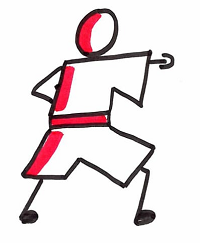

# Organize a code kata session
  

A kata, or code kata, is defined as an exercise in programming which helps hone your skills through practice and repetition.  

Resources :
* [What is a code kata ?](http://codekata.com/)
* Katas websites
    * https://www.codewars.com/
    * https://github.com/gamontalvo/awesome-katas
    * https://www.codingame.com/start