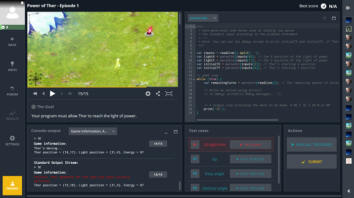

# Codingame

## What ?
CodinGame is a challenge-based training platform for programmers where you can improve your coding skills with fun exercises (25+ languages supported).

## Why ?
Practicing is at the heart of the software craftsman mindset that is why resolving puzzles and challenges in a fun way on this platform is important.  

## How ?
* Go to [codingame.com](https://www.codingame.com)
* [Create an account] if necessary
* Log in
* Choose you favorite language (C#, Python, Javascript, Java, C++, Dart, Scala, Swift, ...)
* Start a challenge
* Win it of course ;-)

## Resources
* [codingame.com](https://www.codingame.com)
* [10 programming challenges platforms](https://programmingzen.com/10-programming-challenges-sites/)

## Share
[ Share this challenge](https://twitter.com/home?status=I%20have%20just%20completed%20the%20Codingame%20%23craft_challenges%20from%20%40agilepartner%20http://tiny.cc/p7v5vy)