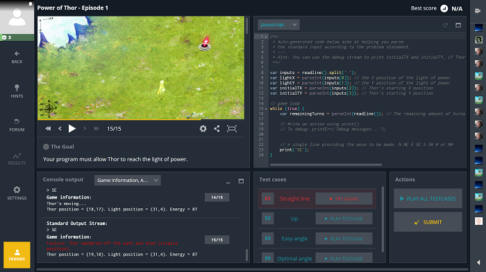

# Do an exercise on the coding game web site

* Go to [codingame.com](https://www.codingame.com)
* [Create an account] if necessary
* Log in
* Choose you favorite language (C#, Python, Javascript, Java, C++, Dart, Scala, Swift, ...)
* Start a challenge
* Win it ;-) of course

## What is codingame.com ?
It a website where you can learn programming with a multiplayer live coding strategy game for beginners.

