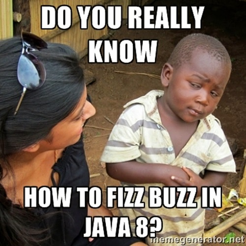

# Fizzbuzz
  

* Select a programming language you do not know
* Write a "Fizzbuzz" game program in this **unknown language**

## What is the Fizzbuzz game ?
Fizz buzz is a group word game for children to teach them division.
Players take turns to count incrementally, replacing any number divisible by three with the word "fizz", and any number divisible by five with the word "buzz".

## Resources
* [Fizzbuzz rules](https://en.wikipedia.org/wiki/Fizz_buzz)
* [List of programming languages](https://en.wikipedia.org/wiki/List_of_programming_languages)
* [Fizzbuzz on github](https://github.com/search?utf8=%E2%9C%93&q=fizzbuzz&type=)

  
