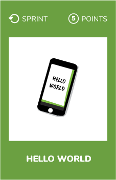

# Hello world
  

## What ?

Choose a platform other than the one you are used to work with and write your first Hello World app.

## Why ?

Learn new things and stimulate your creativity.

## How ?

Search on the internet for a platform you would like discover or choose from one of those:

* [Android SDK and Developer studio](https://developer.android.com/studio/)
* [PVSnesLib : A small, open and free development kit for the Nintendo SNES](https://github.com/alekmaul/pvsneslib)
* [OldSchool Library (OSLib) MODv2, a 2D graphics library for the PSP](https://github.com/dogo/oslibmodv2)
* [C library for Nintendo DS](https://libnds.devkitpro.org/)
* [SGDK: A small, open and free development kit for the Sega Megadrive](https://github.com/Stephane-D/SGDK)

Setup you dev environement and emulator and build your first app to validate this challenge.

## Share
[ Share this challenge](https://twitter.com/home?status=I%20have%20just%20completed%20the%20Hello%20World%20%23craft_challenges%20from%20%40agilepartner%20http://tiny.cc/p7v5vy)