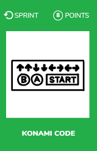

# Konami code
  

Implement a konami code in your current project.

## What is a konami code
A Konami Code (Japanese: コナミコマンド, Konami komando, "Konami command") is a **cheat code** that appears in many Konami video games.  
The code is also present as an **Easter egg** on a number of websites.

## Example
In 2017, the Bank of Canada placed an Easter egg on its website promoting its new $10 bill.  
Typing the Konami code on the website plays the national anthem and fills the screen with animated banknotes or fireworks.

  
