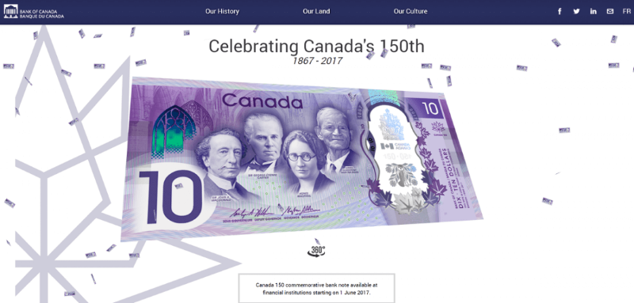

# Konami code
  

## What ?
A Konami Code (Japanese: コナミコマンド, Konami komando, "Konami command") is a **cheat code** that appears in many Konami video games.  The code is also present as an **Easter egg** on a number of websites.

### Example
In 2017, the Bank of Canada placed an Easter egg on its website promoting its new $10 bill.  
Typing the Konami code on the website plays the national anthem and fills the screen with animated banknotes or fireworks.

  

## Why ?
Because it is another way to practice and it's really fun.

## How ?
* Implement a konami code in a website
* You can for example :
    * Play a song
    * Display a picture
    * Redirect the user
    * ...

> You can use the one on this page for example ;-)

## Resources
* [How to add a konami code to your website](https://www.instructables.com/id/How-to-Add-Konami-Code-to-Your-Website/)
* [How to add konami code in a website based on html?](https://stackoverflow.com/questions/31626852/how-to-add-konami-code-in-a-website-based-on-html)
* [What is a konami code](https://en.wikipedia.org/wiki/Konami_Code)

  

## Share
[ Share this challenge](https://twitter.com/home?status=I%20have%20just%20completed%20the%20Konami%20code%20%23craft_challenges%20from%20%40agilepartner%20http://tiny.cc/bd40wy)