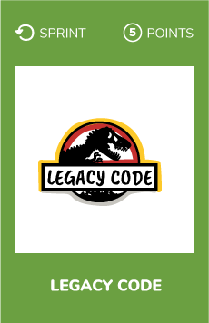
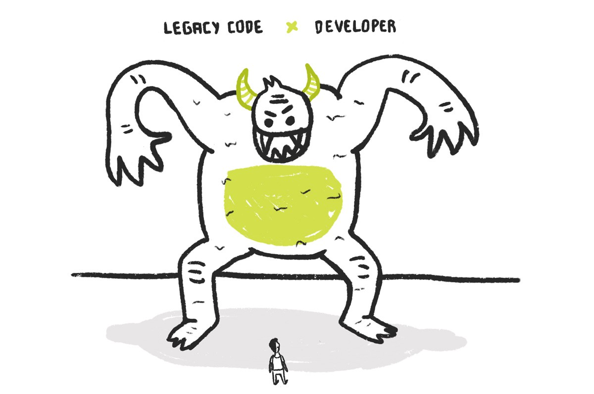
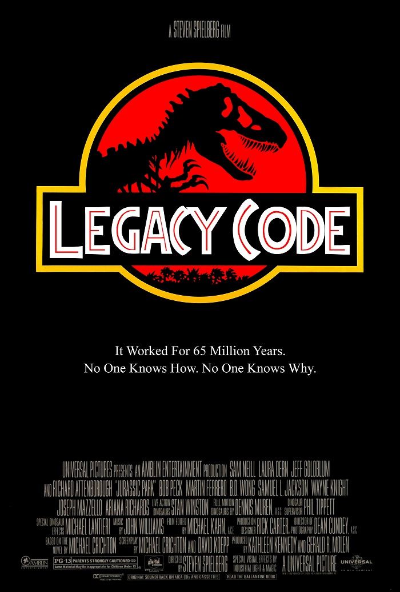

# Legacy code
  

## What ?
**Legacy code** could refer to :
* Dead code : code that is not used anymore
* Highly coupled source code
* Source code type that is no longer supported
* Unsupported operating systems, hardware, frameworks

> To me, legacy code is simply code without tests. - *Michael Feathers* 

Another definition could be : "Code from the past that we inherit"

## Why ?
Sometimes we need to deal with legacy code in our projects. And that's perfectly fine.  
Working with this kind of code is a good way to learn and improve. 

What we need to do is to get legacy code under control otherwise our technical debts will increase. The only way to "save" this kind of code is by refactoring it.

 
### What is refactoring ?
Code refactoring is the process of restructuring existing computer code — **changing the factoring — without changing its external behavior**.

## How ?
* Define what does *"legacy code"* mean in your context (with your team mates)
* Identify legacy code in your current project
* Make an agreement with your team on how to refactor it
* Refactor the code

## Resources
* [Legacy Code: What It Is and 5 Tips for Handling It](https://dzone.com/articles/legacy-code-what-it-is-and-5-tips-for-handling-it)
* [How to refactor legacy code](https://code.tutsplus.com/tutorials/refactoring-legacy-code-part-1-the-golden-master--cms-20331)
* [How to rescue legacy code through refactoring](https://blog.intracto.com/paying-technical-debt-how-to-rescue-legacy-code-through-refactoring)
* [Working effectively with legacy code book - Michael Feathers](https://www.amazon.com/Working-Effectively-Legacy-Michael-Feathers/dp/0131177052)
