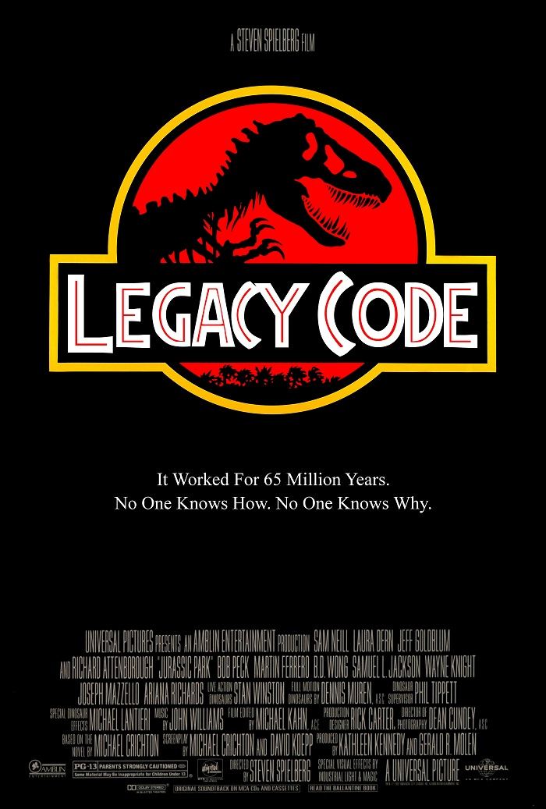

# Legacy code
  

* Define what is your legacy code with your team mates
* Identify legacy code in your current project
* Make an agreement with your team on how to refactor it
* Refactor the code

## What is refactoring
Code refactoring is the process of restructuring existing computer code — changing the factoring — without changing its external behavior.

## Examples of legacy code definitions
> To me, legacy code is simply code without tests. ~ Michael Feathers 

### Legacy code could refer to :
* Dead code : code that is not used anymore
* Highly coupled source code
* Source code type that is no longer supported
* Unsupported operating systems, hardware, frameworks

## Resources
* [How to refactor legacy code](https://code.tutsplus.com/tutorials/refactoring-legacy-code-part-1-the-golden-master--cms-20331)
* [How to rescue legacy code through refactoring](https://blog.intracto.com/paying-technical-debt-how-to-rescue-legacy-code-through-refactoring)
* [Working effectively with legacy code book - Michael Feathers](https://www.amazon.com/Working-Effectively-Legacy-Michael-Feathers/dp/0131177052)

