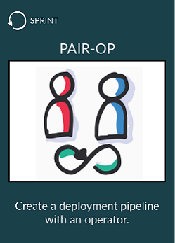
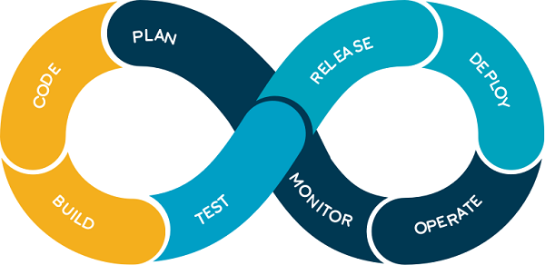

# Pair-op
  

Working on the same computer with an operator is the best way to **share the knowledge about the deployment process** in your company.

* Sit with an op
* Create or discover a deployment pipeline with him

## What is a deployment pipeline ?
A deployment pipeline is an automated manifestation of your process for getting software from version control into the hands of end users.  

  