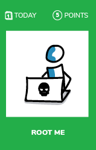
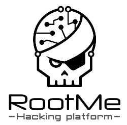

;# Root-Me

## What ?
**Root-Me** is a non-profit organization which goal is to **promote the spread of knowledge related to hacking and information security** in a **fun and interactive way**.  
Hacking challenges are the heart of the project.  
Several web environments allow users to test their skills legally.  
Each challenge needs different knowledge and approaches.

## Why ?

Hacking exist since the early days of computers. Its more and more important today as evereverthing is connected, and because our systems are more and more complex and Agile has changed the way we deliver software.

## How ?
* Create an account on the [Root-Me platform](https://www.root-me.org/)
* Choose a topic you would like to discover: _Cracking, Cryptanalysis, Forensic, Network, Programming, Steganography, Web_
* Challenges are sorted by their level of difficulty; start with the first one to discover the category and then experiment the others
* For each challenge the goal is to find the key and score points

## Share
[ Share this challenge](https://twitter.com/home?status=I%20have%20just%20completed%20the%20Root-Me%20%23craft_challenges%20from%20%40agilepartner%20http://tiny.cc/p7v5vy)