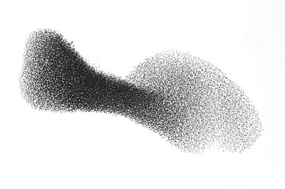

# Agile swarming
  

Start a user story development in an "agile swarming" way.

## What is agile swarming
Every team member works on the same user story/product backlog item/feature at the same time.
* Start with a design session
    * Talk about the story
    * Split it
    * Reach an agreement on how to implement it
* Put TODOs in your code

## Benefits
> Everyone is aligned on the story to deliver
* Architecture
* Implementation
* Business  
It will save you a lot of time.

## Puzzle Driven Development
PDD, or Puzzle Driven Development, is a method used to break down programming tasks into smaller ones and enable their implementation in parallel.  
Basically in group :
* Create skeleton of the implementation
* Put TODOs in the code

## Resources
* [Seven strategies for team swarming](http://tobeagile.com/2012/12/11/seven-strategies-for-team-swarming/)
* [Puzzle Driven Development explained](http://www.yegor256.com/2009/03/04/pdd.html)

  
