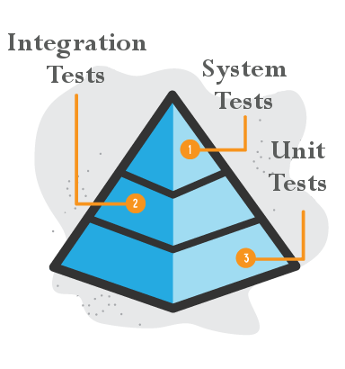
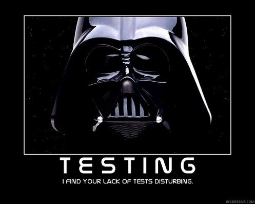

# Unit tests
  

## What ?
UNIT TESTING is a level of software testing where **individual units/ components of a software are tested**.  
The purpose is to validate that each unit of the software performs as designed.  
A unit is the smallest testable part of any software. It usually **has one or a few inputs and usually a single output**.  
In object-oriented programming, the smallest unit is a method, which may belong to a base/ super class, abstract class or derived/ child class.  
Unit testing frameworks, stubs, and mock/ fake objects are used to assist in unit testing.

  

## Why ?
Because we care about what we do we need to be able to guarantee the quality of our development, unit testing is the main practice to do so.  
These are the main benefits :
* Increases confidence in changing/ maintaining code
    * Run every time any code is changed
	* Catch any defects introduced due to the change
	* Code loosely coupled to be testable
* Codes are more reusable
    * Codes need to be modular in order to be tested
* Development is faster
    * Writing tests takes time but the time is compensated by the less amount of time it takes to run the tests (far less than with human checks)
* Easy Debugging
    * When a test fails, only the latest changes need to be debugged
* Codes are more reliable

  

## How ?
* Add 5 more unit tests in your code base
* If you have no tests on your current product code base, it is time to begin
    * Create a test project/folder
    * Add a dependency to a Unit Test framework (Xunit for example)
    * Write the first tests

> ### No matter the languages you are using you can write unit tests.

  

## Share
[ Share this challenge](https://twitter.com/home?status=I%20have%20just%20completed%20the%20Unit%20tests%20%23craft_challenges%20from%20%40agilepartner%20http://tiny.cc/p7v5vy)

