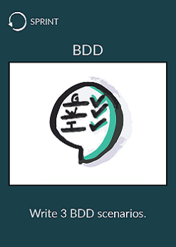
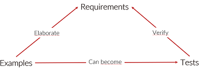

# Write 3 BDD scenarios
 

* Go to your seat
* Add 3 more BDD scenarios to your code base

## What is Behavior Driven Development
Behaviour Driven Development (BDD) is a synthesis and refinement of practices stemming from Test Driven Development (TDD) and Acceptance Test Driven Development (ATDD).  
BDD augments TDD and ATDD with the following tactics:  
* Implement only those behaviors which contribute most directly to these business outcomes, so as to minimize waste
* Describe behaviors in a single notation which is directly accessible to domain experts, testers and developers, so as to improve communication (mostly Gherkin syntax)

## Use examples to describe specifications is powerful
`Examples are easier to understand and harder to misinterpret.`

 

Use Gherkin syntax to do so.

## Resources
* https://www.departmentofproduct.com/blog/writing-bdd-test-scenarios/
* https://blog.hiptest.net/2016/04/28/getting-started-with-bdd-part-1/
* https://martinfowler.com/bliki/SpecificationByExample.html
* https://blog.red-badger.com/blog/2012/07/31/what-is-specification-by-example
