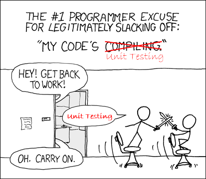

# Write 5 unit tests
  

* Go to your seat
* Add 5 more unit tests in your code base
* If you have no tests on your current product code base, it is time to begin

`No matter the language you are using you can write unit tests.`

  
