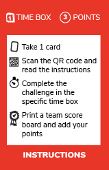

# Craft challenges

Welcome to this software craftsmanship challenge !!!

This repository contains cards and instructions in order to organize craft challenges in your companies.  
Those challenges are organized in 4 categories :

## [Challenges](challenges/)
## [Dev](dev/)  
## [Practices](practices/)
## [Culture](culture/)  

### Aim of the game
Share the practices and the mindset associated to software craftsmanship.  
Take some time to [read this page](software craftsman/) before to start.

### How to play ?
You can use the cards as described below :  
* Each team member takes 1 card
* He/she has to connect to the related page on github through the **QR code or the url**
* Take some time to deep dive into the topic
* Do the challenge in the given time box (at the top left of the card)

(Optional):
* Print a score board and hang it on the wall in your office
* Add the points you earned by doing this card (on the top right of the card)
* Buy something nice for the winner of the challenge! 

#### OR use it as you want :
* Topics for retrospectives
* Topics for lean coffees
* Deep dive in brown bag lunches
* ...

#### Instructions card :

> You can print all the cards [here](craft-challences-cards.pdf)
