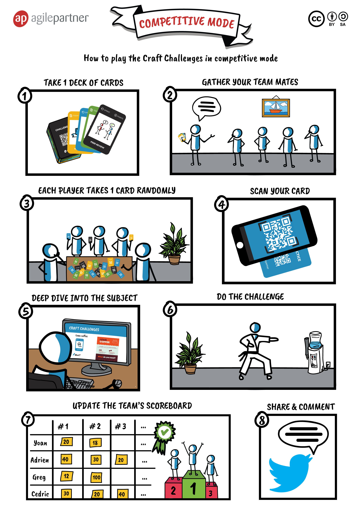
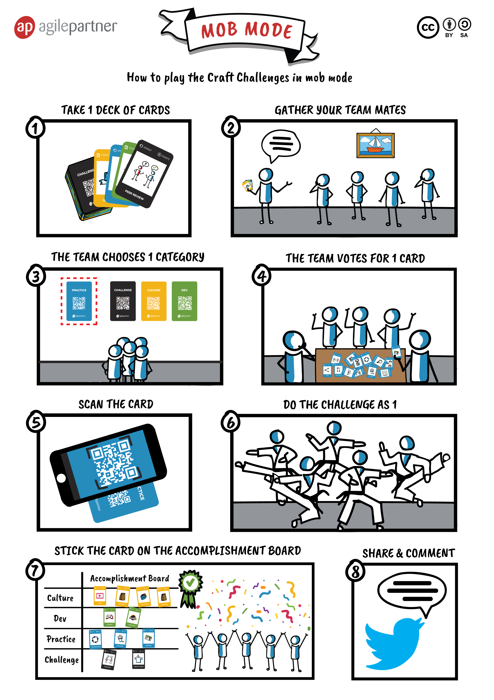

# Welcome

Welcome to this software craftsmanship challenge !!!  
This site contains cards and instructions to organize and play craft challenges in your organizations.  

# Aim of this game
Share the practices and the mindset associated to software craftsmanship and agile.  
Take some time to [read this page](software craftsman/) before to start.

# How to play ?
## 2 proposed game modes

OR

> Please share, for each card you can :
> * Tweet the completed challenges
> * Comment directly on the page

## Another mode = use this deck as you want
* Topics for retrospectives
* To wedge a table
* ...

We trust you you'll figure it out

# 4 categories

## [Challenges](challenges/)
## [Dev](dev/)  
## [Practices](practices/)
## [Culture](culture/)  

# To print
* [Print the game modes](files/craft-challenges-modes.pdf)
* [Print the cards](files/craft-challenges-cards.pdf)
* [Print the score boards](files/scoreboards.pdf)