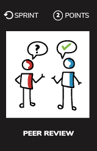

# Peer review

## What ?
Review other team members code  
  
because this kind of things can happen...

What we recommend is to add the peer review step into your process of delivery (inside your **Definition of Done** for example)

## Why ?
Practicing `code review` aims :
* To improve code quality
* To share knowledge
* To find bugs

Practicing `code review` in another team promotes :
* Collaboration
* Communication

## How ?
* Go to another team
* Ask them to review a user story or a pull request
* Provide some feedback about it

## Resources
* [What is code review](https://smartbear.com/learn/code-review/what-is-code-review/)
* [Why code reviews matter ?](https://www.atlassian.com/agile/code-reviews)
* [Code review definition](https://en.wikipedia.org/wiki/Code_review)
* [Best practices](https://smartbear.com/learn/code-review/best-practices-for-peer-code-review/)
