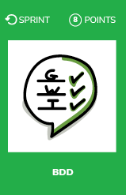
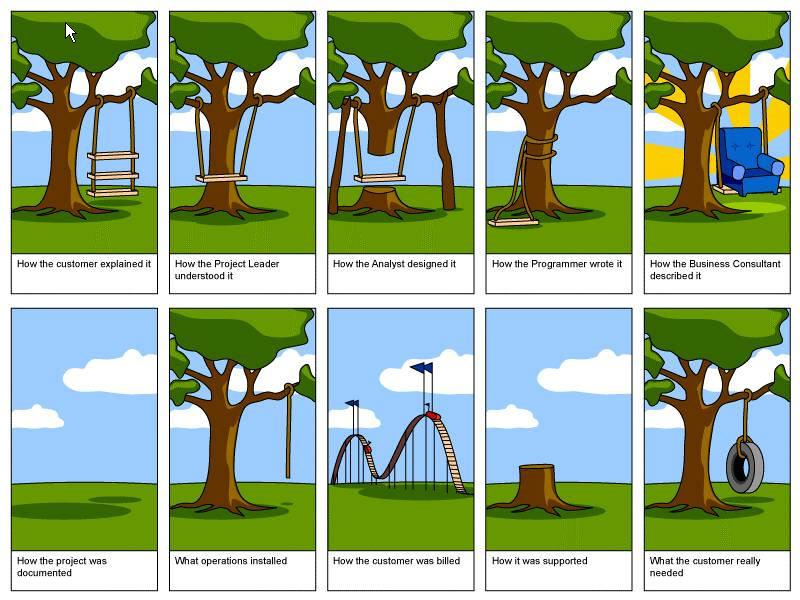

# BDD
 

## What ?
Behaviour Driven Development (BDD) is a synthesis and refinement of practices stemming from Test Driven Development (TDD) and Acceptance Test Driven Development (ATDD).  
BDD augments TDD and ATDD with the following tactics:  
* Implement only those behaviors which contribute most directly to these business outcomes, so as **to minimize waste**
* **Describe behaviors in a single notation** which is directly **accessible to domain experts, testers and developers, so as to improve communication** (mostly Gherkin syntax)

 

## Why ?
The whole idea behind the approach is to use examples to define requirements and business-oriented functional tests.  
We can do it by  capturing and illustrating requirements using realistic examples instead of abstract statements.  

Because those examples are turned into scenarios, those scenarios become automated tests, we can say that those examples describe the system in a **living documentation** way.

This living documentation of the system is understandable by everyone (from developers to domain experts) and is always up-to-date (because the scenarios are turned into automated test).

> Examples are easier to understand and harder to misinterpret.

 

## How ?
* Go to your computer
* Add 3 new BDD scenarios to your code base
    * If none at the time
        * Find the most appropriate framework for your project (cucumber in Java, Specflow in .NET for examples)
        * Add dependency to the selected framework
        * Create a new scenario
        * Create the steps associated to the scenario

## Resources
* [Writing BDD test scenarios](https://www.departmentofproduct.com/blog/writing-bdd-test-scenarios/)
* [Getting started with BDD](https://blog.hiptest.net/2016/04/28/getting-started-with-bdd-part-1/)
* [How to start with Cucumber](https://www.cuelogic.com/blog/how-to-start-with-cucumber-automation/)
* [What is Specification by example](https://blog.red-badger.com/blog/2012/07/31/what-is-specification-by-example)
* [Specification by example explained by Martin Fowler](https://martinfowler.com/bliki/SpecificationByExample.html)
