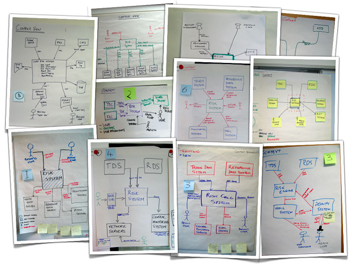

# Architecture

**1) In solo**
* Think about your current project
* Think about the architecture
* Draw a big picture diagram on a A4 paper sheet

**2) Team work**
* Ask to everyone in your team to the same exercise
* Compare your visions

## Our tips
> Forget what you have learned about modeling language such as UML, Merise or others. Here we just want to create alignement so do not add any complexity.

## Benefits
It is a good way to validate that everyone in the team has the same level of understanding about the architecture.
It will create **alignment**.

It will also create a safe place to talk about the current architecture and maybe also about the **future things that needs to be addressed**.

## Resources
* [Interesting talk about how to represent your architecture](https://www.youtube.com/watch?v=oDpdaXt0HQI) by Simon Brown

